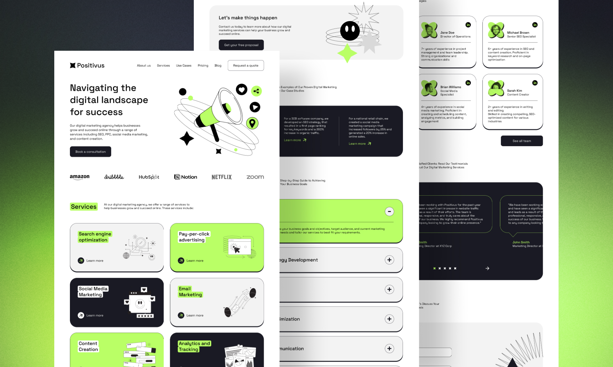

# Landing page "Positivus"

- HTML,
- SCSS,
- Gulp,
- JS,
- Accessibility,
- Responsiveness (Desktop-first and Mobile-first approaches),
- Techniques with local variables


Install dependencies:
```
npm i
```

Run in development mode:
```
gulp
```

Build for production:
```
gulp docs
```
<p align="center">
  
</p>
[Watch demo](https://sergeyzheleznyak1.github.io/positivus/)
